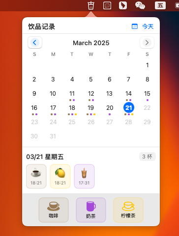

# Coffee Tea

一个轻量级的 macOS 菜单栏应用，用于记录和跟踪你的咖啡和奶茶消费习惯。

## 功能特点

- **常驻菜单栏**：应用在菜单栏中显示一个小图标，不会在 Dock 中显示
- **快速记录**：点击图标即可快速记录咖啡或奶茶的消费
- **日历视图**：直观地查看每日消费记录
- **长按提示**：长按图标显示今日消费统计
- **右键菜单**：提供快速记录和设置选项

## 使用方法

### 快速记录

1. 点击菜单栏图标，弹出记录窗口
2. 点击"咖啡"或"奶茶"按钮记录一杯
3. 按住 Option 键点击按钮可以输入自定义数量

### 查看统计

- 长按菜单栏图标查看今日消费统计
- 在弹出窗口中查看日历视图，了解历史消费记录

### 右键菜单

右键点击菜单栏图标，可以：
- 快速记录咖啡（快捷键：C）
- 快速记录奶茶（快捷键：T）
- 打开日历视图（快捷键：O）
- 退出应用（快捷键：Q）

## 系统要求

- macOS 11.0 或更高版本

## 开发信息

- 使用 SwiftUI 和 SwiftData 开发
- 支持深色/浅色模式自适应 